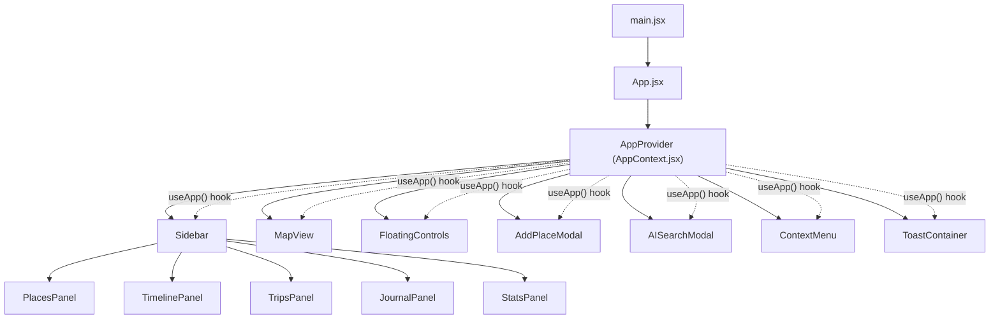

# 🌍 TRACE — Complete Project Walkthrough

## What is TRACE?

**TRACE** is a personal location-based memory and journaling Progressive Web App (PWA). It positions itself as more than a map — it's a "personal location operating system" that lets users:

- **Save places** with emojis, categories, notes, and vibes
- **Journal** location-based memories
- **Plan trips** with geographic itineraries
- **Search** places using a natural-language AI-style command bar (`⌘K`)
- **View analytics** — heatmaps, sparklines, top spots, and a "Yearly Wrapped"
- **Browse a timeline** of past location events with moods

The demo is themed around **Bengaluru, India** with realistic sample data (cafés, restaurants, parks, trips to Goa/Coorg, a planned Tokyo trip, etc.).

---

## Tech Stack

| Layer | Technology | Version |
|---|---|---|
| **Framework** | React | 19.2.6 |
| **Bundler** | Vite | 8.0.12 |
| **Styling** | TailwindCSS v4 | 4.3.0 (via `@tailwindcss/vite` plugin) |
| **Map** | Leaflet | 1.9.4 (OSM tiles) |
| **Icons** | lucide-react | 1.17.0 |
| **Fonts** | Google Fonts | Syne (display), DM Sans (body), JetBrains Mono (mono) |
| **PWA** | Service Worker + Manifest | Custom `sw.js` |

> [!NOTE]
> There is **no backend, no database, and no real AI**. All data is hard-coded demo data in [data.js](file:///e:/Projects/mapz/src/data.js). User-added places are persisted to `localStorage`. The "AI search" uses simulated delays + canned results.

---

## Project Structure

```
mapz/
├── index.html                 # Entry HTML (PWA meta tags, Google Fonts)
├── vite.config.js             # Vite + React + TailwindCSS v4 plugins
├── package.json               # Dependencies
├── public/
│   ├── favicon.svg            # App icon
│   ├── icons.svg              # SVG sprite sheet
│   ├── manifest.json          # PWA manifest (shortcuts, icons, theme)
│   └── sw.js                  # Service worker (caching strategies)
├── reference/
│   ├── mapz.html              # Reference/prototype HTML (68KB — likely the original monolith)
│   ├── manifest.json          # Reference manifest
│   └── sw.js                  # Reference service worker
└── src/
    ├── main.jsx               # React root + SW registration
    ├── App.jsx                # App shell layout
    ├── App.css                # Legacy/unused CSS from Vite scaffold
    ├── index.css              # Design system (TailwindCSS theme, keyframes, base, components)
    ├── data.js                # All demo data constants
    ├── assets/                # Static assets (hero.png, react.svg, vite.svg)
    ├── context/
    │   └── AppContext.jsx     # Global state provider (map, modals, places, toasts, etc.)
    └── components/
        ├── Sidebar.jsx        # Left sidebar (logo, search, tabs, panel content)
        ├── MapView.jsx        # Leaflet map initialization
        ├── FloatingControls.jsx  # Map overlays (satellite toggle, AI button, zoom, geo, legend, onboard)
        ├── AddPlaceModal.jsx  # Modal to save a new place
        ├── AISearchModal.jsx  # ⌘K AI search modal
        ├── ContextMenu.jsx    # Right-click context menu on map
        ├── ToastContainer.jsx # Toast notification system
        └── panels/
            ├── PlacesPanel.jsx    # Pinned places, collections, recently visited
            ├── TimelinePanel.jsx  # Chronological event timeline with mood tags
            ├── TripsPanel.jsx     # Trip cards (planning vs. done)
            ├── JournalPanel.jsx   # Geo-journal entries
            └── StatsPanel.jsx     # Analytics (hero stat, grid, sparkline, heatmap, wrapped)
```

---

## Architecture & Data Flow



### State Management — [AppContext.jsx](file:///e:/Projects/mapz/src/context/AppContext.jsx)

A single React Context (`AppContext`) acts as a global store. All components access it via the `useApp()` hook. Key state:

| State | Purpose |
|---|---|
| `mapRef` | Ref to the Leaflet `L.map` instance |
| `activeTab` | Current sidebar tab (`places`, `timeline`, `trips`, `journal`, `stats`) |
| `addModalOpen` / `aiModalOpen` | Modal visibility toggles |
| `ctxMenu` / `ctxLatLng` | Right-click context menu position + lat/lng |
| `mapStyle` / `satOn` | Map tile filter style (dark/topo/streets/satellite) |
| `onboardVisible` | Onboarding tooltip visibility |
| `toasts` | Array of active toast notifications |
| `savedPlaces` | User-added places (persisted to `localStorage`) |

Key actions exposed: `flyTo`, `showToast`, `switchTab`, `openAddModal`, `openAIModal`, `addPlace`, `dropPin`, `locateMe`, `navigateTo`, `copyCoords`, `changeMapStyle`, `toggleSatellite`.

---

## Component Deep Dive

### [MapView.jsx](file:///e:/Projects/mapz/src/components/MapView.jsx)
- Initializes a Leaflet map centered on **Bengaluru** (12.9716, 77.5946)
- Uses OSM tiles with a CSS filter hack to create a dark map theme (no paid tile provider needed)
- Registers right-click → context menu and long-press (mobile) → context menu
- Calls `initMarkers()` on mount to render all demo + saved places as emoji markers
- Markers use `L.divIcon` with inline HTML for emoji rendering + hover scale animation
- Popups are HTML strings (not React components) with action buttons wired via `window.__trace` globals

### [Sidebar.jsx](file:///e:/Projects/mapz/src/components/Sidebar.jsx)
- Fixed-width 340px left panel with glassmorphic background
- Contains: logo bar, search input with inline AI dropdown, 5-tab navigation, and the active panel
- Search simulates AI with a 680ms debounce delay returning `INLINE_SUGGESTIONS`
- Tabs: Places, Timeline, Trips, Journal, Stats — each mapped to a panel component

### [FloatingControls.jsx](file:///e:/Projects/mapz/src/components/FloatingControls.jsx)
Six sub-components overlaid on the map:
1. **TopBar** — Satellite toggle + ⌘K AI Search button
2. **BottomBar** — Map style switcher (Dark/Topo/Streets/Satellite)
3. **ZoomControls** — +/- zoom buttons
4. **GeoButton** — "My location" geolocation trigger
5. **MapLegend** — Emoji legend strip
6. **OnboardChip** — First-run tooltip ("Right-click to save a place")

### [AddPlaceModal.jsx](file:///e:/Projects/mapz/src/components/AddPlaceModal.jsx)
- Full modal form: emoji picker, name input, category pills, note textarea, vibe selector
- Validates name is non-empty (red border flash on error)
- On save: creates a marker on the map, flies to it, persists to `savedPlaces` state → `localStorage`

### [AISearchModal.jsx](file:///e:/Projects/mapz/src/components/AISearchModal.jsx)
- Spotlight-style command palette (⌘K)
- Input with simulated 600ms "thinking" animation (bouncing dots)
- Always returns `AI_RESULTS` from demo data (no real AI)
- Quick prompt chips at the bottom for common searches

### [ContextMenu.jsx](file:///e:/Projects/mapz/src/components/ContextMenu.jsx)
- Appears on map right-click with 5 actions: Save place, Journal entry, Drop pin, Navigate (opens Google Maps), Copy coordinates
- Viewport-aware positioning to prevent overflow

### Panel Components
- **[PlacesPanel](file:///e:/Projects/mapz/src/components/panels/PlacesPanel.jsx)** — Pinned places, collections, recently visited. Cards with emoji, name, address, note, category badge, tags.
- **[TimelinePanel](file:///e:/Projects/mapz/src/components/panels/TimelinePanel.jsx)** — Vertical timeline with connected dots, month headers, mood chips. Highlighted events get a purple glow.
- **[TripsPanel](file:///e:/Projects/mapz/src/components/panels/TripsPanel.jsx)** — Trip cards split by status (Planning/Done). Each shows day-by-day itinerary rows.
- **[JournalPanel](file:///e:/Projects/mapz/src/components/panels/JournalPanel.jsx)** — Date-stamped journal entries with location pins and prose body text.
- **[StatsPanel](file:///e:/Projects/mapz/src/components/panels/StatsPanel.jsx)** — Rich analytics: hero number, 2×2 stat grid, canvas sparkline chart, GitHub-style activity heatmap, top spots ranking, "2025 Wrapped" section, keyboard shortcuts reference.

---

## Design System — [index.css](file:///e:/Projects/mapz/src/index.css)

Uses **TailwindCSS v4** `@theme` directive for custom design tokens:

### Color Palette
| Token | Value | Usage |
|---|---|---|
| `--color-void` | `#07070d` | Deepest background |
| `--color-base` | `#0d0d18` | Base layer |
| `--color-layer` | `#12121f` | Card backgrounds |
| `--color-surface` | `#18182a` | Hover states |
| `--color-elevated` | `#1e1e32` | Elevated cards/inputs |
| `--color-primary` | `#6c63ff` | Brand purple |
| `--color-primary-light` | `#a78bfa` | Light purple accent |
| `--color-glass` | `rgb(12 12 22 / 0.88)` | Glassmorphism overlay |

### Typography
- **Display**: Syne (headings, logo, stats)
- **Body**: DM Sans (text, labels, inputs)
- **Mono**: JetBrains Mono (tags, counters, shortcuts)

### Animations
- `fade-slide-in` — card entrance
- `pulse-dot` — logo heartbeat
- `toast-in` / `toast-out` — spring toast animations
- `geo-pulse` — geolocation button pulse
- `bounce-dot` — AI thinking indicator

### Mobile Responsive
At `≤680px`: sidebar moves to bottom 56% of screen, map shrinks to 44%, floating controls reposition or hide.

---

## PWA Infrastructure

### [manifest.json](file:///e:/Projects/mapz/public/manifest.json)
- Standalone display, dark theme (`#07070d`)
- App shortcuts: "Add Place", "Timeline", "AI Search" (via URL params `?action=add`, `?tab=timeline`, `?action=search`)
- Categories: navigation, travel, lifestyle

### [sw.js](file:///e:/Projects/mapz/public/sw.js)
Three caching strategies:
1. **Cache-first** — for static assets (app shell)
2. **Network-first** — for `/api/` routes (data, currently unused)
3. **Tile caching** — separate cache for map tiles (MapTiler/tile URLs)

Also includes stubs for:
- **Background Sync** (`sync-places` tag — empty implementation)
- **Push Notifications** (proximity-based alerts — wired but no push server)

### Keyboard Shortcuts
- `⌘K` / `Ctrl+K` — Open AI search
- `N` — New place modal
- `Esc` — Close any modal/menu
- Right-click map — Context menu

### URL Parameters (on mount)
- `?action=add` → opens Add Place modal
- `?action=search` → opens AI Search modal
- `?tab=<name>` → switches sidebar tab

---

## Data Layer — [data.js](file:///e:/Projects/mapz/src/data.js)

All demo content is exported as constants:

| Export | Description |
|---|---|
| `DEMO_PLACES` | 6 sample locations with lat/lng, emoji, name, address, notes, categories, tags |
| `COLLECTIONS` | 3 place collections (Best Cafés, Date Spots, Biryani Trail) |
| `TIMELINE` | 7 timeline events grouped by month with mood tags |
| `TRIPS` | 3 trips (Tokyo planning, Goa done, Coorg done) with day breakdowns |
| `JOURNAL_ENTRIES` | 3 prose journal entries with dates and locations |
| `STATS` | Analytics data: total places, per-category counts, top spots, sparkline data, wrapped insights |
| `AI_RESULTS` | 4 canned AI search results |
| `INLINE_SUGGESTIONS` | 4 inline search suggestions |
| `QUICK_PROMPTS` | 4 quick search chips |
| `EMOJI_OPTIONS` | 12 emoji choices for place picker |
| `CATEGORY_OPTIONS` | 7 place categories |
| `VIBE_OPTIONS` | 6 mood/vibe choices |
| `LEGEND_ITEMS` | 5 map legend entries |
| `MAP_FILTERS` | CSS filter strings for 4 map styles |
| `BADGE_STYLES` | Category → color mapping for badges |

---

## Key Technical Patterns

1. **Leaflet + React**: Map is imperatively initialized in a `useEffect` with a ref guard (`initRef`). Markers are plain Leaflet objects (not React-Leaflet), with popup HTML strings and `window.__trace` globals for popup button actions.

2. **Glassmorphism everywhere**: Heavy use of `backdrop-filter: blur()` + semi-transparent backgrounds (`var(--color-glass)`) on sidebar, popups, floating controls, and modals.

3. **Dark map hack**: Instead of using a paid dark map tile provider, OSM tiles are CSS-filtered with `invert(1) hue-rotate(180deg) brightness(0.68) saturate(0.52) contrast(1.15)`.

4. **Canvas charts**: StatsPanel draws sparkline and heatmap using raw Canvas API (no charting library).

5. **Simulated AI**: All "AI" features use `setTimeout` + static data to simulate latency and search results.

6. **localStorage persistence**: Only user-added places are persisted. No auth or cloud sync.

---

## `reference/` Directory

Contains [mapz.html](file:///e:/Projects/mapz/reference/mapz.html) (68KB) — likely the **original monolithic prototype** of the entire app in a single HTML file, before it was refactored into the current React/Vite component structure. Also has its own `manifest.json` and `sw.js`.

---

## Observations & Potential Improvements

> [!TIP]
> These are observations, not bugs — the app is a polished demo/prototype.

- **[App.css](file:///e:/Projects/mapz/src/App.css)** is entirely leftover Vite scaffold CSS (`.counter`, `.hero`, `#center`, `#next-steps`, etc.) — **not used anywhere** in the actual app.
- **No routing** — single-page, tab-based navigation only.
- **No real data persistence** beyond `localStorage` — no backend, database, or auth.
- **AI is fully simulated** — always returns the same 4 results regardless of query.
- **Popup buttons use `window.__trace` globals** — works but is a brittle pattern; React portals or react-leaflet would be more robust.
- **`TimelinePanel.reduce`** returns value via `push` side effect — works but `flatMap` would be cleaner.
- **Mobile responsiveness** is handled via a single `@media (max-width: 680px)` breakpoint — no tablet breakpoint.
- **No tests** — no test files, frameworks, or test scripts in `package.json`.
- **Assets** (`hero.png`, `react.svg`, `vite.svg`) appear to be Vite scaffold leftovers.
